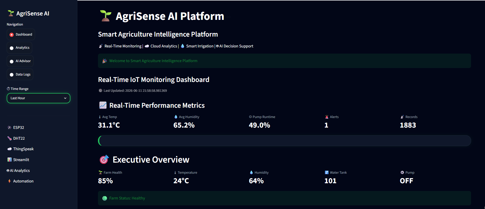
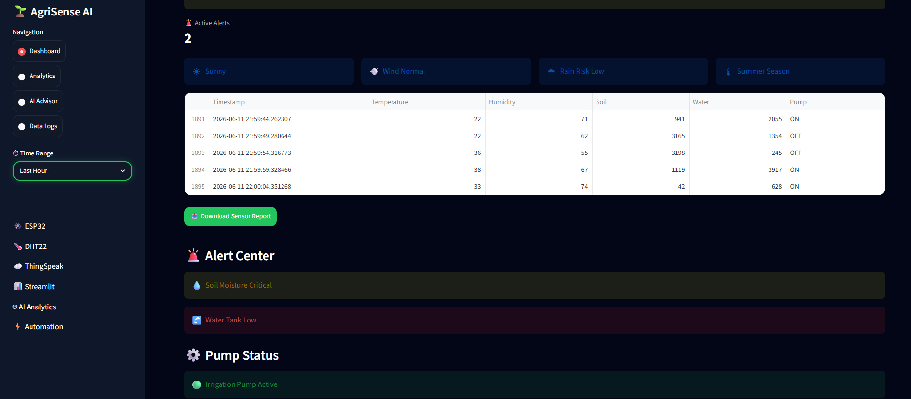
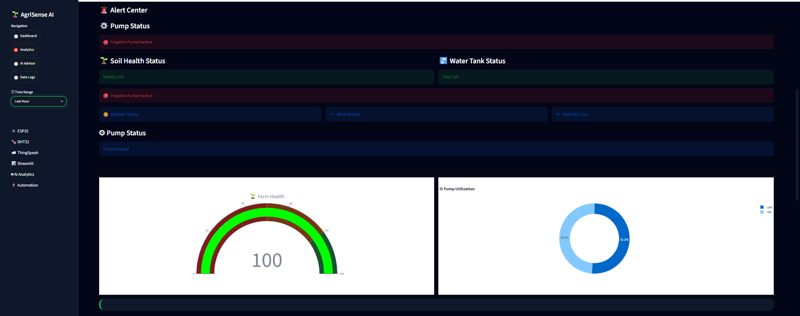
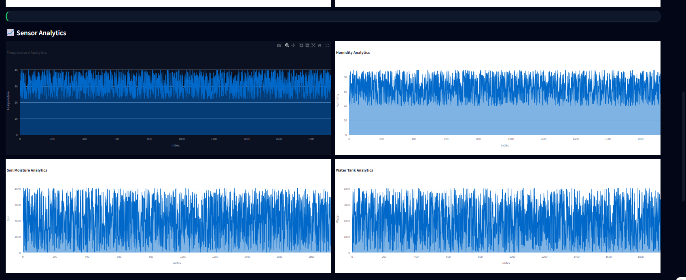
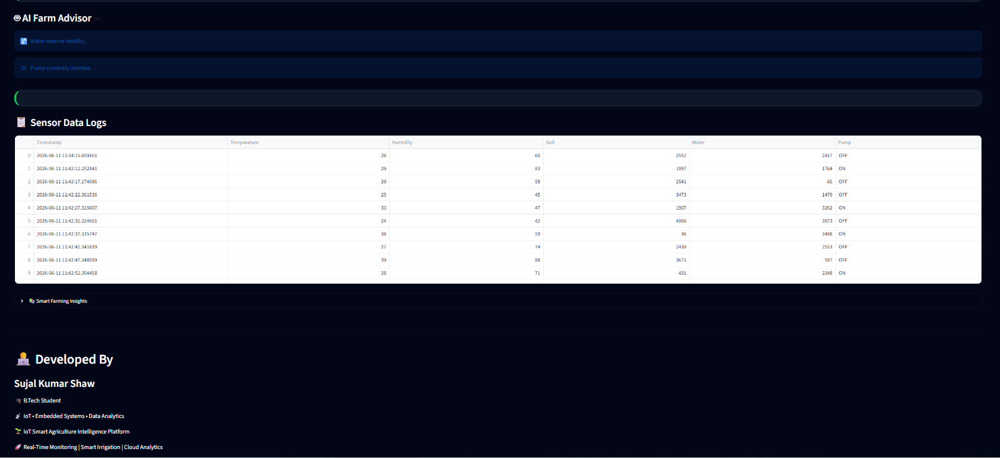
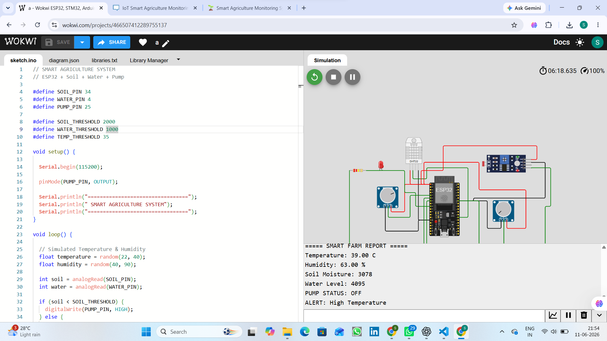
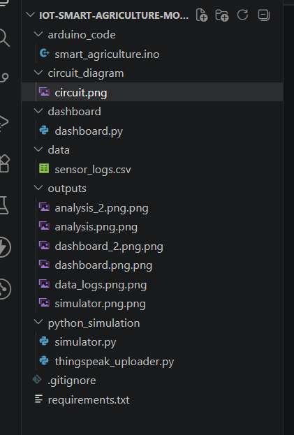

# 🌱 IoT Smart Agriculture Intelligence Platform


---

# 🚀 Project Overview

The **IoT Smart Agriculture Intelligence Platform** is an end-to-end smart farming solution designed to monitor critical agricultural parameters, generate intelligent recommendations, and support automated irrigation decisions.

This project combines:

* 🌡 Temperature Monitoring
* 💧 Humidity Monitoring
* 🌱 Soil Moisture Analysis
* 🚰 Water Tank Monitoring
* ⚙ Automated Irrigation Logic
* 📊 Interactive Analytics Dashboard
* 🤖 AI-Based Farm Recommendations
* ☁ Cloud-Ready Architecture
* 📈 Historical Data Analysis

The platform demonstrates how modern IoT technologies can improve crop management, reduce water wastage, and support precision agriculture.

---

# 🎯 Problem Statement

Traditional farming often relies on manual monitoring of field conditions.

This creates challenges such as:

* Water wastage
* Delayed irrigation decisions
* Lack of real-time visibility
* Increased labor requirements
* Reduced crop productivity

The objective of this project is to create a smart monitoring and decision-support system that helps farmers make data-driven irrigation and crop management decisions.

---

# 🌍 Real World Applications

This solution can be used in:

* Smart Farming
* Precision Agriculture
* Greenhouse Monitoring
* Agricultural Research Labs
* Nursery Management
* Irrigation Automation
* AgriTech Startups
* Educational IoT Demonstrations

---

# 🏗 System Architecture

```text
ESP32 Sensors
      │
      ▼
Sensor Data Collection
      │
      ▼
Python Data Simulation
      │
      ▼
CSV Data Storage
      │
      ▼
Streamlit Dashboard
      │
      ▼
Analytics & Alerts
      │
      ▼
AI Recommendations
      │
      ▼
Irrigation Decisions
```

---

# 📡 Parameters Monitored

| Parameter        | Purpose                           |
| ---------------- | --------------------------------- |
| 🌱 Soil Moisture | Detect dry soil conditions        |
| 🌡 Temperature   | Monitor environmental temperature |
| 💧 Humidity      | Measure atmospheric moisture      |
| 🚰 Water Level   | Monitor water availability        |
| ⚙ Pump Status    | Track irrigation system activity  |

---

# ⚡ Key Features

## 🌱 Smart Farm Health Score

Calculates overall farm health using:

* Soil Moisture
* Temperature
* Water Availability

---

## 🚨 Intelligent Alert System

Automatically generates alerts:

* Soil Dry Alert
* High Temperature Alert
* Low Water Level Alert
* Pump Status Alert

---

## 📊 Advanced Dashboard Analytics

Provides:

* Temperature Trends
* Humidity Trends
* Soil Moisture Trends
* Water Level Trends
* Pump Utilization Analytics

---

## 🤖 AI Farm Advisor

Generates recommendations such as:

* Start irrigation
* Monitor heat stress
* Check water reserves
* Optimize irrigation schedule

---

## 📥 Downloadable Reports

Users can export:

* Sensor Logs
* Historical Data
* Analytics Reports

---

# 🛠 Technology Stack

## Hardware Layer

* ESP32
* DHT22 Sensor
* Soil Moisture Sensor
* Water Level Sensor
* Relay Module
* Irrigation Pump

## Software Layer

* Python
* Pandas
* Streamlit
* Plotly
* CSV Storage

## Cloud Layer

* ThingSpeak (Optional)
* MQTT (Optional)

---

# 📂 Project Structure

```text
IoT-Smart-Agriculture-Intelligence-Platform
│
├── arduino_code
│   └── smart_agriculture.ino
│
├── circuit_diagram
│   ├── diagram.json
│   └── circuit.png
│
├── dashboard
│   └── dashboard.py
│
├── python_simulation
│   ├── simulator.py
│   └── thingspeak_uploader.py
│
├── data
│   └── sensor_logs.csv
│
├── images
│   ├── dashboard.png
│   ├── architecture.png
│   └── logo.png
│
├── docs
│   └── project_report.pdf
│
├── README.md
├── requirements.txt
└── .gitignore
```

---

# 📈 Dashboard Features

### Executive Overview

* Farm Health Score
* Temperature KPI
* Humidity KPI
* Water Level KPI
* Pump Status KPI

### Analytics

* Farm Health Gauge
* Pump Utilization Chart
* Temperature Analytics
* Humidity Analytics
* Soil Analytics
* Water Analytics

### AI Recommendations

* Heat Stress Detection
* Irrigation Suggestions
* Water Tank Monitoring
* Farm Condition Assessment

---

# ▶ Installation

## Clone Repository

```bash
git clone https://github.com/yourusername/IoT-Smart-Agriculture-Intelligence-Platform.git
```

```bash
cd IoT-Smart-Agriculture-Intelligence-Platform
```

---

## Install Requirements

```bash
pip install -r requirements.txt
```

---

## Run Simulator

```bash
python python_simulation/simulator.py
```

---

## Launch Dashboard

```bash
streamlit run dashboard/dashboard.py
```

---

# 📊 Sample Output

```text
Temperature : 34°C
Humidity    : 68%
Soil        : 1850
Water       : 2450

ALERT:
Soil Moisture Low

PUMP:
ON

AI Recommendation:
Start irrigation cycle.
```

---

## 📸 Project Screenshots

### 🏠 Main Dashboard



---

### 📊 Dashboard Analytics View



---

### 📈 Analytics Overview



---

### 📉 Advanced Analytics



---

### 📋 Sensor Data Logs



---

### 🖥️ Python Simulator



---

### 🏗️ System Architecture


---

# 📚 Learning Outcomes

Through this project I gained experience in:

* IoT System Design
* Sensor Integration
* Embedded Systems
* Data Analytics
* Dashboard Development
* Streamlit Development
* Data Visualization
* Smart Agriculture Applications
* Automation Logic
* Git & GitHub

---

# 🚀 Future Enhancements

* ☁ ThingSpeak Live Integration
* 📱 Mobile Application
* 🌦 Weather API Integration
* 📡 MQTT Communication
* 🤖 Machine Learning Predictions
* 🌱 Crop Recommendation Engine
* 📍 GPS-Based Monitoring
* ☀ Solar-Powered Deployment

---

# 👨‍💻 Developer

## Sujal Kumar Shaw

B.Tech Student

Interests:

* IoT
* Embedded Systems
* Data Analytics
* Automation
* Smart Agriculture
* AI Applications

---

### ⭐ If you found this project useful, consider giving it a star.
